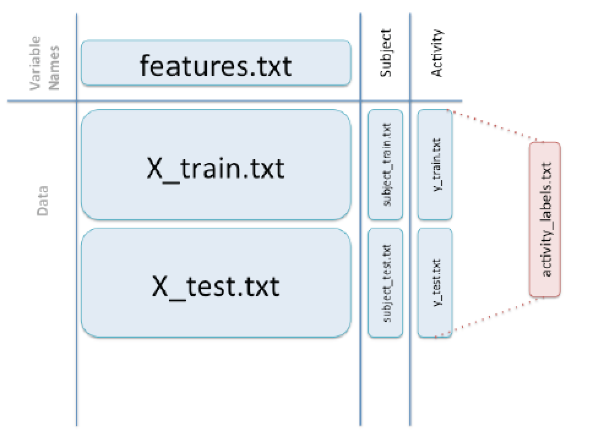

CodeBook for Getting and Cleaning the Data Course Project
========================================================
The Data
--------------------------------------------------------
This project is based on the Human Activity Recognition Using Smartphones Dataset.
The data were collected from sensors with the Samsung Galaxy smartphone from 30 subjects each performing 6 activities: LAYING, SITTING, STANDING, WALKING, WALKING_UPSTAIRS, WALKING_DOWNSTAIRS. 

**Data download metadata**  
https://d396qusza40orc.cloudfront.net/getdata%2Fprojectfiles%2FUCI%20HAR%20Dataset.zip

"Download date:" "2014-08-23 08:44:44 EDT"
[1] "Download URL:" "https://d396qusza40orc.cloudfront.net/"
[1] "Downloaded file Information"
                                         size isdir mode               mtime               ctime
getdata-projectfiles-UCI HAR Dataset.zip  231 FALSE  644 2014-08-23 08:43:30 2014-08-23 08:43:30

The dataset is from the following source:  
Davide Anguita, Alessandro Ghio, Luca Oneto, Xavier Parra and Jorge L. Reyes-Ortiz. *Human Activity Recognition on Smartphones using a Multiclass Hardware-Friendly Support Vector Machine. International Workshop of Ambient Assisted Living (IWAAL 2012).* Vitoria-Gasteiz, Spain. Dec 2012.

**Data files used in this course project**  
* activity_labels.txt   : descriptive names for the 6 activities performed by the subjects: LAYING, SITTING, STANDING, WALKING, WALKING_UPSTAIRS, WALKING_DOWNSTAIRS
* features.txt          : descriptive variable names for the 561 variable measures in the test and train sets
* X_train.txt           : train dataset: 7352 observations for 561 variables
* X_test.txt            : test dataset: 2497 observations for 561 variables
* y_train.txt           : numeric activity codes (1-6) for X_train.txt : a 7352x1 vector
* y_test.txt            : numeric activity codes (1-6) for X_test.txt : a 2497x1 vector
* subject_train.txt     : subject identifiers (1-30) for X_train.txt : a 7352x1 vector
* subject_test.txt      : subject identifiers (1-30) for X_test.txt : a 2497x1 vector

The zip file includes a README.txt which provides more detail about the data. This codebook describes just the portions used for this course project.  

The existing data are divided in a test and train set. The data in each set are distributed as observatsions of 561 measured variables for each subject (X_test.txt and X_train.txt); subject labels (subject_test.txt and subject.train.txt); and activity codes for the activities performed (y_test.txt and y_train.txt). To create one data set, I added the subjects and activity codes as columns to the X_test.txt and X_train.txt sets, respectively. I then merged the test and train sets into one data set of 10299 (7352+2497) rows x 561 columns.

I replaced the original column names of V1, V2, ... V561, with the descriptive variable names from features.txt. I also added a column of descriptive activity names from activity_labels.txt.   

This image from David Hood in his David's Course Project FAQ (https://class.coursera.org/getdata-006/forum/thread?thread_id=43) shows how these files fit together. 



Code Book
--------------------------------------------------------
### The Variables 
#### Sensor measurement variables
561 time and frequency domain variables corresponding to the recorded sensor measures.
After reading this thread https://class.coursera.org/getdata-006/forum/thread?thread_id=132, I decided to use the variable names in features.txt as the descriptive names of these variables for this project. There was also some discussion about errors in the original descriptive variable names (BodyBody). I have not attempted to second guess the authors of the original study and leave all original descriptive names as-is. 

The motivation for keeping the original descriptive names is 
* to maintain compatibility with others who might use the dataset
* there is no straightforward renaming system that is a clear improvement over the existing descriptive names

#### Mean and STD
I includes all measures with "[Mm]ean" and "[Ss]td" in Step 2 for the course project, extracting the mean and standard deviation measures. A shorter list can be obtained by limiting the grep to just [Mm]ean() and [Ss]td() but based on this thread it seems that there is no definitive answer https://class.coursera.org/getdata-006/forum/thread?thread_id=248.  So these are the names of the variables selected for Step 2. 

```
names(mean.std.measures)
 [1] "tBodyAcc-mean()-X"                    "tBodyAcc-mean()-Y"                   
 [3] "tBodyAcc-mean()-Z"                    "tBodyAcc-std()-X"                    
 [5] "tBodyAcc-std()-Y"                     "tBodyAcc-std()-Z"                    
 [7] "tGravityAcc-mean()-X"                 "tGravityAcc-mean()-Y"                
 [9] "tGravityAcc-mean()-Z"                 "tGravityAcc-std()-X"                 
[11] "tGravityAcc-std()-Y"                  "tGravityAcc-std()-Z"                 
[13] "tBodyAccJerk-mean()-X"                "tBodyAccJerk-mean()-Y"               
[15] "tBodyAccJerk-mean()-Z"                "tBodyAccJerk-std()-X"                
[17] "tBodyAccJerk-std()-Y"                 "tBodyAccJerk-std()-Z"                
[19] "tBodyGyro-mean()-X"                   "tBodyGyro-mean()-Y"                  
[21] "tBodyGyro-mean()-Z"                   "tBodyGyro-std()-X"                   
[23] "tBodyGyro-std()-Y"                    "tBodyGyro-std()-Z"                   
[25] "tBodyGyroJerk-mean()-X"               "tBodyGyroJerk-mean()-Y"              
[27] "tBodyGyroJerk-mean()-Z"               "tBodyGyroJerk-std()-X"               
[29] "tBodyGyroJerk-std()-Y"                "tBodyGyroJerk-std()-Z"               
[31] "tBodyAccMag-mean()"                   "tBodyAccMag-std()"                   
[33] "tGravityAccMag-mean()"                "tGravityAccMag-std()"                
[35] "tBodyAccJerkMag-mean()"               "tBodyAccJerkMag-std()"               
[37] "tBodyGyroMag-mean()"                  "tBodyGyroMag-std()"                  
[39] "tBodyGyroJerkMag-mean()"              "tBodyGyroJerkMag-std()"              
[41] "fBodyAcc-mean()-X"                    "fBodyAcc-mean()-Y"                   
[43] "fBodyAcc-mean()-Z"                    "fBodyAcc-std()-X"                    
[45] "fBodyAcc-std()-Y"                     "fBodyAcc-std()-Z"                    
[47] "fBodyAcc-meanFreq()-X"                "fBodyAcc-meanFreq()-Y"               
[49] "fBodyAcc-meanFreq()-Z"                "fBodyAccJerk-mean()-X"               
[51] "fBodyAccJerk-mean()-Y"                "fBodyAccJerk-mean()-Z"               
[53] "fBodyAccJerk-std()-X"                 "fBodyAccJerk-std()-Y"                
[55] "fBodyAccJerk-std()-Z"                 "fBodyAccJerk-meanFreq()-X"           
[57] "fBodyAccJerk-meanFreq()-Y"            "fBodyAccJerk-meanFreq()-Z"           
[59] "fBodyGyro-mean()-X"                   "fBodyGyro-mean()-Y"                  
[61] "fBodyGyro-mean()-Z"                   "fBodyGyro-std()-X"                   
[63] "fBodyGyro-std()-Y"                    "fBodyGyro-std()-Z"                   
[65] "fBodyGyro-meanFreq()-X"               "fBodyGyro-meanFreq()-Y"              
[67] "fBodyGyro-meanFreq()-Z"               "fBodyAccMag-mean()"                  
[69] "fBodyAccMag-std()"                    "fBodyAccMag-meanFreq()"              
[71] "fBodyBodyAccJerkMag-mean()"           "fBodyBodyAccJerkMag-std()"           
[73] "fBodyBodyAccJerkMag-meanFreq()"       "fBodyBodyGyroMag-mean()"             
[75] "fBodyBodyGyroMag-std()"               "fBodyBodyGyroMag-meanFreq()"         
[77] "fBodyBodyGyroJerkMag-mean()"          "fBodyBodyGyroJerkMag-std()"          
[79] "fBodyBodyGyroJerkMag-meanFreq()"      "angle(tBodyAccMean,gravity)"         
[81] "angle(tBodyAccJerkMean),gravityMean)" "angle(tBodyGyroMean,gravityMean)"    
[83] "angle(tBodyGyroJerkMean,gravityMean)" "angle(X,gravityMean)"                
[85] "angle(Y,gravityMean)"                 "angle(Z,gravityMean)"   
```

### Transformations for Cleaning the Data
The following transformations were performed on the data to produce the tidyData.txt file
for Step 5 of the course project instructions:

1. The data were put together according to the image above, using rbind and cbind. This added
columns for subject (1-30) and activity code (1-6)
2. Descriptive names were added for the activity codes from the activity_label.txt file 
3. The mean for each activity for each subject was computed

This is the first six rows from the tidyData.txt table, showing the mean for subjects 1-6 for all measures for the activity LAYING: 
````
  activity subjects       mean
1   LAYING        1 -0.6075224
2   LAYING        2 -0.6399738
3   LAYING        3 -0.6414458
4   LAYING        4 -0.6308751
5   LAYING        5 -0.6317935
6   LAYING        6 -0.6194214
````

